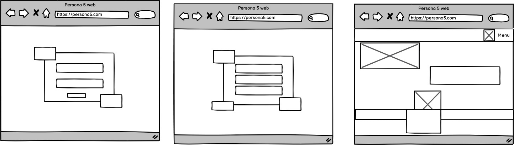
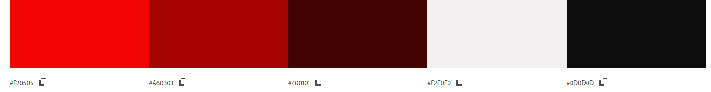
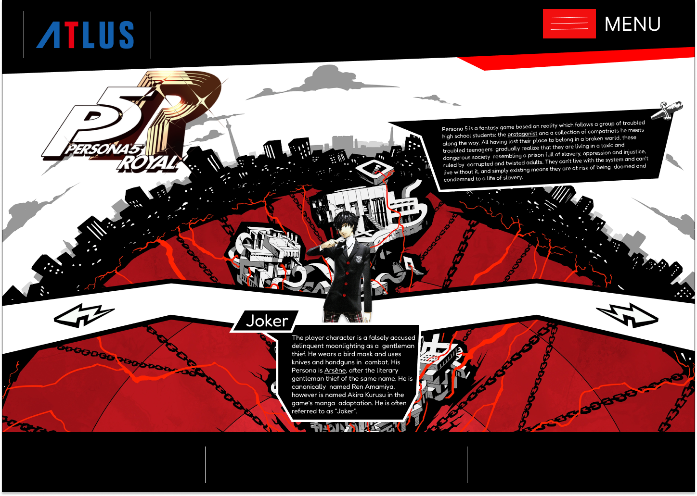
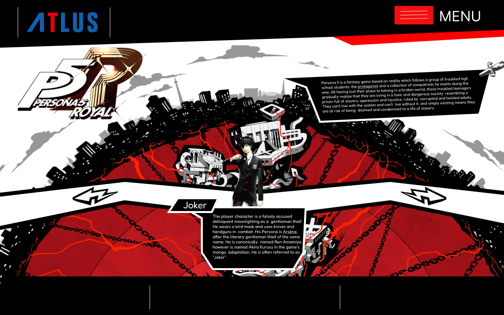
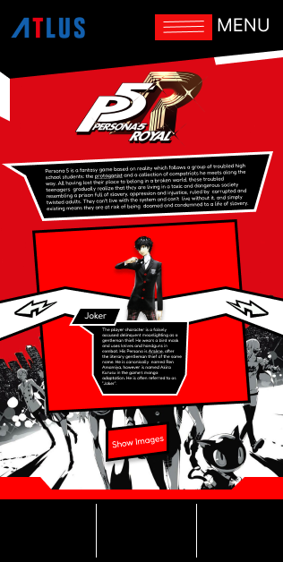

# Persona 5 Web
### Grupo de Samuel Sánchez y David Luis.
# 1. Idea de la aplicación web:

### La aplicación web consistirá en mostrar información sobre el videojuego Persona 5. Así como sus personajes e historia en general.

# 2. Wireframe:

# 3. Mockup:

### Estos son los colores que usaremos en la aplicación web. Predominan el rojo, blanco y negro.

### Para el texto usamos la fuente Fredoka.

# Escritorio

# Tablet

# Móvil

# 4. Prototipo interactivo:
[Enlace al prototipo](https://www.figma.com/proto/fpc97Pz9C7nvwaDKFPqYUC/Untitled?node-id=3-29&node-type=frame&t=rK6gZhV5xuDjxx2F-1&scaling=min-zoom&content-scaling=fixed&page-id=0%3A1&starting-point-node-id=3%3A29)
